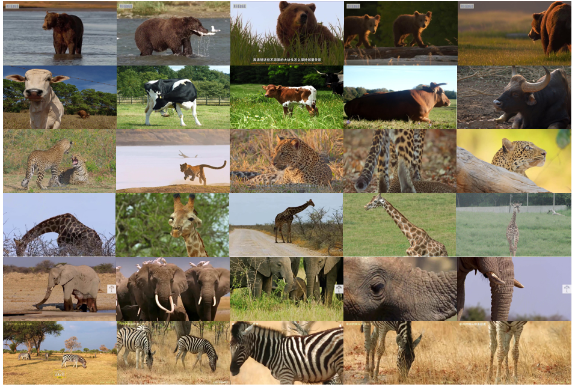
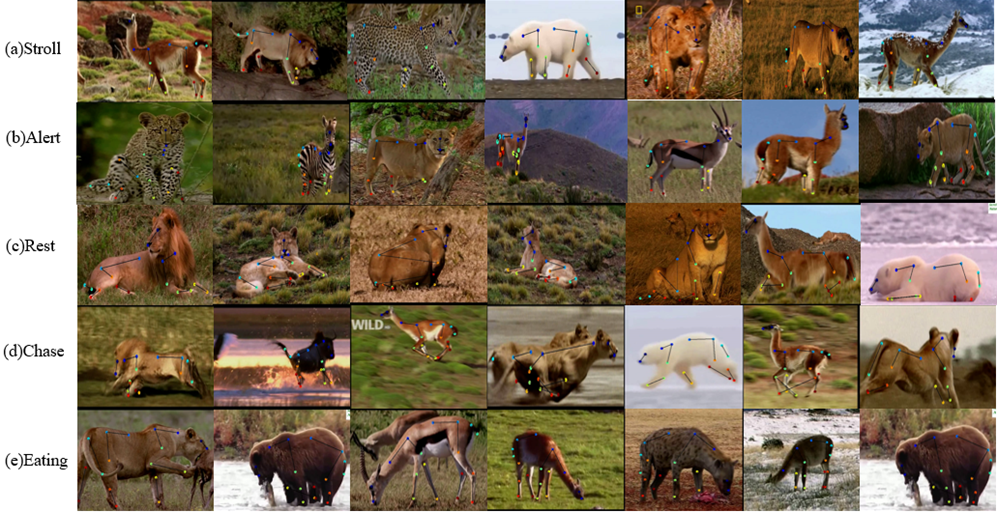

# MammalClub: An Annotated Wild Mammal Dataset for Species recognition, Re-identification and Behavior recognition.

## Introduction
This repository is the official reporisity of MammalClub: An Annotated Wild Mammal Dataset for Species recognition, Re-identification and Behavior recognition. MammalClub is a publicly available, more comprehensive mammalian intelligent recognition dataset. The dataset contains 24 species with a total of 0.12 million images. It includes three sub-datasets, i.e. species recognition sub-dataset, re-identification sub-dataset, and behavior recognition sub-dataset. Among them, we describe the image annotation of species identification and behavior identification.

## Overview
### Species recognition sub-dataset

### Behavior recognition sub-dataset

### The wild mammal re-identification sub-dataset

## Download
The dataset can be downloaded from
[Baidu Pan](https://pan.baidu.com/s/1_9-MacauQxIatkvpRpFksA) (code: )